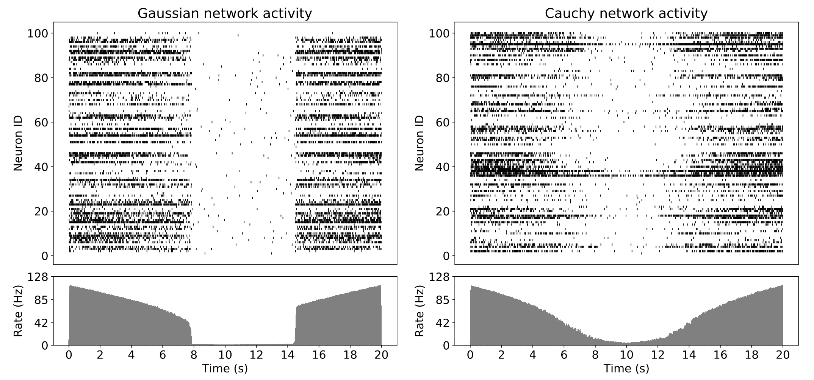

## Motivation
In one’s daily life, the Gaussian distribution can be found everywhere: the height of crowds, the cumulative point summation of tosses, the random errors measured from a certain rig, etc. This phenomenon is due to the Central Limit Theorem, which will be proved by us later using the characteristic function. However, when a system approaches criticality, such as a sandpile undergoing avalanches, a lot of properties within it will follow a heavy-tailed distribution, normally a power-law distribution. Our neural system has long been conjectured to be a near-critical system because some properties, for example, the synaptic weight and the scale of a single activity propagation, follow a power-law distribution. In this blog, I will introduce the concept of the characteristic function and the Generalized Central Limit Theorem, and discuss a beautiful PRL paper on how the heavy-tailed synaptic weights affect the dynamics of a neural network and cause a second-order phase transition.

## The introduction of the Characteristic Function
The central limit theorem states that the sum or average of a large number of independent random variables with finite variance tends to follow a normal distribution, regardless of the original distribution. To prove this, there are two interesting facts in this statement that we need to focus on. The first one is “sum”, which means this theorem emerges under the “sum” operation. The second one is “finite variance”; this is a strong constraint to meet, and if it is violated, we are then in the playground of the Generalized Central Limit Theorem.

Let’s first look into the summation operation. Suppose $X$ and $Y$ are i.i.d. variables, let $Z=X+Y$. The probability distribution of $Z$ could be written as:
$$
f_Z(z) = \int_{-\infty}^{\infty} f_X(x) f_Y(z - x) dx=f_X * f_Y(z)
$$

Therefore, the summation of random variables corresponds to the convolution of probabilistic distribution functions. However, we do not like convolutions, it's better to turn that into a simpler operation. Fourier space provides a good angel to this problem according to the Convolution Theorem.

::: {#thm-conv}

## Convolution Theorem

The Fourier Transform of the convolution equals the product of the Fourier transforms of these two functions. Note that the formula expression below regard Fourier Transform as "the inner product with $e^{itx}$", which is different from our convention $e^{-itx}$. It actually doesn't matter which one we choose, both of these could separate the $sin$ and $cos$ components, and what we should do is just adjust the inverse Fourier Transform forms to match the Fourier Transform form.

$$
\int_{-\infty}^{+\infty}
(f_X * f_Y)(z)e^{itz}\,dz
=
\left(
\int_{-\infty}^{+\infty}
f_X(x)e^{itx}\,dx
\right)
\left(
\int_{-\infty}^{+\infty}
f_Y(y)e^{ity}\,dy
\right)
$$

:::

::: {.proof}

Easy to prove. Just do an expansion and a variable substitution.

$$
\int_{-\infty}^{+\infty}
(f_X * f_Y)(z)e^{itz}\,dz
=
\int_{-\infty}^{+\infty}
\int_{-\infty}^{+\infty} f_X(x) f_Y(z - x)  e^{itz}\,dxdz
$$

Let $y=z-x$, $dy=dz$:
$$
\int_{-\infty}^{+\infty}
\int_{-\infty}^{+\infty} f_X(x) f_Y(z - x)  e^{itz}\,dxdz
=
\int_{-\infty}^{+\infty}
\int_{-\infty}^{+\infty} f_X(x) f_Y(y)  e^{itx}e^{ity}\,dxdy
$$

$$
=
\left(
\int_{-\infty}^{+\infty} f_X(x)e^{itx}\,dx
\right)
\left(
\int_{-\infty}^{+\infty} f_Y(y)  e^{ity}\,dy
\right)
$$

Therefore, the identity is proved.
:::

Based on this theorem, if we want to define a quantity that can fully describe the original distribution and have a nice property when dealing with the variable summation problem, the Fourier Transform is a good choice.

::: {#def-charact}

## Characteristic Function of a probability distribution

Here we use $\phi_X(t)$ to represent the characteristic function of random variable $X$, and $f_X(x)$ is the probability density function.

$$
\phi_X(t) := \mathbb{E}\left[e^{itX}\right]
=
\int_{-\infty}^{+\infty}
e^{itx} f_X(x)\,dx
$$

:::

If we want the Characteristic Function of $Z=X+Y$, we could have the following relation based on the Convolution Theorem:

$$
\phi_{X+Y}(t)
=
\phi_X(t)\phi_Y(t)
$$

Or more generally:

$$
\phi_{\sum_{i=1}^n X_i}(t)
=
\prod_{i=1}^n \phi_{X_i}(t)
$$

There is a property of the Characteristic Function that is useful to our following derivation. From this property we could have a intuitive impression of how the Characteristic Function "encodes" the probability distribution.

Let's first consider the derivative of the Characteristic Function:
$$
\phi_X'(t)
=
\int_{-\infty}^{+\infty}
ix e^{itx}f_X(x)\,dx
$$

If we take $t=0$, we have:
$$
\phi_X'(0)=\int_{-\infty}^{+\infty}
ix f_X(x)\,dx=i\mathbb{E}[X]
$$

The second order derivative:
$$
\phi_X''(t)
=
\int_{-\infty}^{+\infty}
(-x^2)e^{itx}f_X(x)\,dx
$$

And therefore:
$$
\phi_X''(0)
=
\int_{-\infty}^{+\infty}
(-x^2)f_X(x)\,dx
=
-\mathbb{E}[X^2]
$$

In a similar fashion, we could have the generic form:
$$
\phi_X^{(n)}(0)
=
i^n \mathbb{E}[X^n]
$$

From the equation above we could observe that the momemts of this probability distribution are encoded in the derivatives of its characteristic function at the origin.

Therefore, if the corresponding moments exist, we can write the characteristic function in its Maclaurin expansion:

$$
\phi_X(t)
=
1
+
\phi_X'(0)t
+
\frac{\phi_X''(0)}{2!}t^2
+
...
=
1
+
it\,\mathbb{E}[X]
-
\frac{t^2}{2}\mathbb{E}[X^2]
+
...
$$

And we could use this expansion form to prove CLT (Central Limit Theorem).

## The proof of the Central Limit Theorem

Suppose we have a sequence of i.i.d. random variables $X_1,X_2,\ldots,X_n,$ with finite mean and variance:
$$
\mathbb{E}[X_i]=\mu,
\qquad
\operatorname{Var}(X_i)=\sigma^2.
$$

The Central Limit Theorem states that the properly centered and rescaled sum
$$
Z_n
=
\frac{1}{\sqrt{n}}
\sum_{i=1}^n\frac{
(X_i-\mu)
}{
\sigma
}
$$

converges in distribution to a standard Gaussian random variable:

$$
Z_n
\xrightarrow{n\to \infty }
\mathcal{N}(0,1).
$$

Instead of directly calculating the probability density of the sum (which would require repeatedly performing convolutions), we study its characteristic function.

Let's first define the standardized random variable $Y_i=\frac{X_i-\mu}{\sigma}$. We have:

$$
\mathbb{E}[Y_i]=0,
\qquad
\mathbb{E}[Y_i^2]=1
$$

Since we want the variance of summation to be $1$, and variance is proportional to random variable number $N$, we need to devide the summation by $\frac{1}{\sqrt{N}}$:
$$
Z_n=
\frac{1}{\sqrt{n}}
\sum_{i=1}^n Y_i
$$

And now let's prove $Z_n$ follows the standard Gaussian distribution.

According to the properties of the Characteristic function, we could write $\phi_{Z_n}(t)$ as:
$$
\phi_{Z_n}(t)=
\phi_{\frac{1}{\sqrt{n}}
\sum_{i=1}^n Y_i}(t)=
\mathbb{E}\left[e^{it\frac{1}{\sqrt{n}}
\sum_{i=1}^n Y_i}\right]
=
\mathbb{E}\left[e^{i(\frac{t}{\sqrt{n}})
\sum_{i=1}^n Y_i}\right]
$$
$$
=
\phi_{\sum_{i=1}^n Y_i}(\frac{t}{\sqrt{n}})
=
\prod_{i=1}^n
\phi_{Y_i}
\left(
\frac{t}{\sqrt{n}}
\right)
$$

Since the $Y_i$ are identically distributed,
$$
\prod_{i=1}^n
\phi_{Y_i}
\left(
\frac{t}{\sqrt{n}}
\right)=
\left[
\phi_Y
\left(
\frac{t}{\sqrt{n}}
\right)
\right]^n
$$

Now we use the Maclaurin expansion of $\phi_Y(t)$. Since $\mathbb{E}[Y]=0$ and $\mathbb{E}[Y^2]=1$, we have, near $t=0$,
$$
\phi_Y(t)=1-\frac{t^2}{2}+o(t^2)
$$

Replacing $t$ by $t/\sqrt{n}$ gives
$$
\phi_Y(t)=
1-\frac{t^2}{2n}+o\left(\frac{1}{n}\right)
$$

Therefore,
$$
\phi_{Z_n}(t)=
\left[1-\frac{t^2}{2n}+o\left(\frac{1}{n}\right)\right]^n
$$

Taking the limit $n\to\infty$, we obtain
$$
\phi_{Z_n}(t)=e^{-t^2/2}
$$

Meanwhile, $e^{-t^2/2}$ is exactly the characteristic function of the standard Gaussian distribution $\frac{1}{\sqrt{2\pi}}e^{-x^2/2}$ (easy to calculate, use the relation $\phi_X'(t)=-t\phi_X(t)$). Hence,
$$
Z_n
=
\frac{1}{\sqrt{n}}
\sum_{i=1}^n\frac{
(X_i-\mu)
}{
\sigma
}
\sim
\mathcal{N}(0,1)
$$

as $n\to\infty$. This proves the Central Limit Theorem.

## Stable Distribution: Invariance Under Summation

The Central Limit Theorem tells us that, for random variables with finite variance, repeated summation followed by a proper rescaling leads to a Gaussian distribution. This naturally raises a more general question:

Are there other distributions whose shape is preserved under summation?

The answer is YES, and such distributions are called **stable distributions**.

For a standard Gaussian random variable, its Characteristic Function is $\phi_Z(t)=e^{-t^2/2}$. A more general family with the same invariance property is given by

$$
\phi_X(t)=e^{-|t|^\alpha}
,
\qquad
0<\alpha\leq 2
$$

We call distributions that have this kind of Characteristic Function the "$\alpha$-stable distribution class". The Gaussian corresponds to the special case $\alpha=2$. Now consider i.i.d. random variables $X_1,\ldots,X_n$ with characteristic function $\phi_X(t)=e^{-|t|^\alpha}$, let's prove their "summation invariance".

The characteristic function of their sum is

$$
\phi_{\sum_{i=1}^n X_i}(t)
=
\left[\phi_X(t)\right]^n
=
e^{-n|t|^\alpha}
$$

Since $n|t|^\alpha=\left|n^{1/\alpha}t\right|^\alpha$, we obtain

$$
\phi_{\sum_{i=1}^n X_i}(t)
=
e^{-\left|n^{1/\alpha}t\right|^\alpha}
=
\phi_X\left(n^{1/\alpha}t\right)
$$

Since 
$$
\phi_X\left(n^{1/\alpha}t\right)=\mathbb{E}\left[e^{in^{1/\alpha}tX}\right]=
\mathbb{E}\left[e^{it(n^{1/\alpha}X)}\right]=\phi_{n^{1/\alpha}X}\left(t\right)
$$

therefore the "summation" operation doesn't change the Characteristic Function and thus doesn't change the distribution shape at all, as long as we do a rescale $X'=n^{1/\alpha}X$ before summation. Or equivalently,

$$
\frac{X_1+\cdots+X_n}{n^{1/\alpha}}
\overset{d}{=}X
$$

Summation changes only the scale of the distribution, while leaving its functional form unchanged. This is the defining feature of a stable distribution. For the Gaussian case $\alpha=2$, the scaling factor becomes $n^{1/\alpha}=\sqrt{n}$, which is exactly the $\sqrt{n}$ scaling appearing in the Central Limit Theorem.

But why must $\alpha\leq 2$? At first sight, one may ask whether $\phi(t)=e^{-|t|^\alpha}$ could also define a probability distribution for $\alpha>2$. Recall that if the second moment exists, $\phi''(0)=-\mathbb{E}[X^2]$. Using the second-order difference quotient：

$$
\phi''(0)
=
\lim_{h\to 0}
\frac{
\phi(h)-2\phi(0)+\phi(-h)
}{
h^2
}
$$

Since $\phi(t)$ is even and $\phi(0)=1$,

$$
\phi''(0)
=
\lim_{h\to0}
\frac{
2\left(e^{-|h|^\alpha}-1\right)
}{
h^2
}.
$$

For small $h$, $e^{-|h|^\alpha}-1=-|h|^\alpha+o(|h|^\alpha)$, therefore:

$$
\phi''(0)
=
\lim_{h\to0}
\left[
-2|h|^{\alpha-2}
+
o\left(|h|^{\alpha-2}\right)
\right].
$$

If $\alpha>2$, we must have $\phi''(0)=0$, and the relation $\phi''(0)=-\mathbb{E}[X^2]$ will lead to $\mathbb{E}[X^2]=0$. Since $X^2\geq0$, this implies $X=0$. But in that case its characteristic function would have to be

$$
\phi_X(t)
=\mathbb{E}[e^{it0}]
=
1,
$$

which contradicts $\phi_X(t)=e^{-|t|^\alpha}$ for $t\neq0$. Therefore the only possible range is $0<\alpha\leq2$. Note that the condition we used: $\phi(0)=1$ is actually the normalization condition for a probability distribution, the results above indicates that a probability distribution can not have normalization and $\alpha>2$ at the same time.

For $\alpha<2$, stable distributions are fundamentally different from the Gaussian. They possess heavy power-law tails. For a symmetric $\alpha$-stable distribution $\phi_X(t)=e^{-|t|^\alpha}$, its probability density behaves asymptotically as:
$$
f_X(x)\sim |x|^{-(1+\alpha)},
\qquad
|x|\to\infty
$$

Correspondingly, the tail probability satisfies $\Pr(|X|>x)\sim x^{-\alpha}$. The $\alpha$ in the Characteristic Function's exponent and the $\alpha$ in the pdf are the same, and I'm gonna explain why. 

Suppose that $f(x)\sim |x|^{-(1+\alpha)}$, for a symmetric distribution,

$$
\phi(t)=
\int_{-\infty}^{\infty}
e^{itx}f(x)\,dx=
\int_{-\infty}^{\infty}
\cos(tx)f(x)\,dx
$$

To explain how these two $\alpha$ are connected, we are curious about the second-order term in the Taylor expansion of $\phi(t)$ (the first-order term is trivial, i.e. $\phi(0)=1$). Consider:

$$
\phi(t)=\int_{-\infty}^{\infty}
\cos(tx)f(x)\,dx
=1-\int_{-\infty}^{\infty}
\left(1-\cos(tx)\right)f(x)\,dx
$$

Given that $f(x)\sim |x|^{-(1+\alpha)}$, we have:

$$
1-\phi(t)\sim
\int_{-\infty}^{\infty}
\left(1-\cos(tx)\right)\cdot|x|^{-(1+\alpha)}\,dx
$$

Now let $u=|t|x,\,dx=\frac{du}{|t|}$. Then:

$$
1-\phi(t)
\sim
|t|^\alpha
\int_{-\infty}^{\infty}
\frac{1-\cos u}{u^{1+\alpha}}
\,du
$$

The integral is a constant independent of $t$, so we may write

$$
1-\phi(t)
\sim
|t|^\alpha
$$

Hence, near $t=0$,

$$
\phi(t)=
1-K|t|^\alpha
+
o(|t|^\alpha)
$$

This is exactly the leading-order behavior of $e^{-K|t|^\alpha}$. Thus the power-law tail $f(x)\sim |x|^{-(1+\alpha)}$ and the nonanalytic Characteristic Function behavior $1-\phi(t)\sim |t|^\alpha$ are two manifestations of the same exponent $\alpha$.

I also want to introduce a special case of this $\alpha$-stable distribution family, the Cauchy distribution ($\alpha=1$). Its characteristic function is $\phi_X(t)=e^{-|t|}$.

Cauchy distribution has an analytic probability density function:
$$
f_X(x)=
\frac{1}{\pi(1+x^2)}\xrightarrow{\text{large} \,|x|}\frac{1}{\pi x^2}
$$

The asymptotic result agrees with the general stable tail relation $f_X(x)\sim |x|^{-(1+\alpha)}$. We can verify its characteristic function using the residue theorem (the following derivation shows the $t>0$ case, but $t<0$ case works in a similar fashion, just choose the lower arc and the polar point $-i$ to meet the Jordan's lemma):

$$
\phi_X(t)=
\int_{-\infty}^{\infty}
\frac{e^{itx}}{\pi(1+x^2)}
\,dx=
\oint
\frac{e^{itz}}{\pi(1+z^2)}
\,dz
=
2\pi i
\operatorname{Res}
\left[
\frac{e^{itz}}{\pi(1+z^2)},
z=i
\right]
=
e^{-t},\qquad t>0
$$

This provides a concrete example of a heavy-tailed stable distribution whose variance does not exist, and this distribution is widely used when we need an analytic result, which we will see in the next section.

## Heavy-Tail Weighted Neural Networks (PRL, 2020)

Let's look into a beautiful work published in Physical Reviews Letters about how the heavy-tailed connection weights affect the dynamics of a recurrent neural network. The network dynamics is defined by:

$$
x_i(t+1)=
\sum_{j=1}^N
J_{ij}\Theta(x_j(t)),
$$

where $\Theta(x)$ is a threshold activation function,

$$
\Theta(x)=
\begin{cases}
1, & x>\theta\\
0, & x\leq\theta
\end{cases}
$$

Instead of choosing Gaussian synaptic weights, suppose that the connections follow a Cauchy distribution:

$$
J_{ij}
\sim
\mathrm{Cauchy}
\left(
0,\frac{g}{N}
\right)
$$

Here $g$ controls the overall coupling strength of the network.

### Why does the Cauchy weight scale as $1/N$?

The system is a fully connected network. For stability, we want the summation of the synapses w.r.t. each neuron, namely the input strength of each neuron, to be $O(1)$. Therefore we need to weaken the synapses as the neuron number increases. Recall that the standard Cauchy distribution has probability density $p(z)=\frac{1}{\pi(1+z^2)}$ and characteristic function $\phi_Z(k)=e^{-|k|}$. The summation of N random Cauchy varianbles $S=\sum_{i=1}^{N}J_i$ has the characteristic funtion:

$$
\phi_{\sum_{i=1}^{N}J_i}(k)=\mathbb{E}[e^{ikN|J|}]
$$

Since we want the summation has the same scale as the original one, we expect their Characteristic Function to be the same. S we update the random varianble as $J'=\frac{1}{N}\cdot J$, thus:

$$
\phi_{\sum_{i=1}^{N}J'_i}(k)=\mathbb{E}[e^{ikN|J'|}]=\mathbb{E}[e^{ik|J|}]=\phi_{J}(k)
$$

Therefore the synapse strength should be scaled as $\frac{g}{N}$. For the same reason, a Gaussian weighted network should be scaled as $\frac{g}{\sqrt{N}}$, since $\phi_{\sum_{i=1}^{N}J_i}(k)=\mathbb{E}[e^{ikNJ^2}]=\mathbb{E}[e^{ik(\sqrt{N}J)^2}]$.

To meet the normalization condition, the scaled Cauchy variable $J=\frac{g}{N}\cdot Z$ has the PDF:

$$
p(J_{ij})=\frac{g}{N}\cdot p(\frac{g}{N}\cdot Z)=\frac{g/N}{\pi\left(1+(\frac{g}{N}z)^2\right)}=
\frac{1}{\pi}
\frac{g/N}{(g/N)^2+J_{ij}^2}
$$

and Characteristic Function:

$$
\phi_{J_{ij}}(k)=
e^{-\frac{g}{N}|k|}
$$

### Mean-Field Dynamics

Now return to the network equation $x_i(t+1)=\sum_j J_{ij}\Theta(x_j(t))$. Conditioned on the activities $\Theta(x_j(t))$, the terms in the sum are independent. Therefore, the characteristic function of $x_i(t+1)$ is

$$
\phi_{x_i(t+1)}(k)=
\mathbb{E}\left[e^{ik\sum_j J_{ij}\Theta(x_j(t))}\right]
=
\prod_j
\mathbb{E}
\left[
e^{ikJ_{ij}\Theta(x_j(t))}
\right]
$$

Since $J_{ij}$ has a clear distribution form $\phi_{J_{ij}}(k)=e^{-\frac{g}{N}|k|}$, we have:
$$
\phi_{x_i(t+1)}(k)=\prod_j\mathbb{E}
\left[
e^{i[\Theta(x_j(t))k]J_{ij}}
\right]=
\prod_j\phi_{J_{ij}}(\Theta(x_j(t))k)
$$

$$
=
\prod_j\exp
\left[
-\frac{g}{N}
|k|
\Theta(x_j(t))
\right]
=
\exp
\left[
-\frac{g}{N}
|k|
\sum_j
\Theta(x_j(t))
\right]
$$

Define the mean activity of the network at time $t$ as $m_t:=\frac{1}{N}\sum_j\Theta(x_j(t))$, then

$$
\phi_{x_i(t+1)}(k)=
e^{-gm_t|k|}
$$

This is exactly the characteristic function of a Cauchy distribution with scale $gm_t$. Therefore, $x_i(t+1)\sim\mathrm{Cauchy}(0,gm_t)$. Equivalently, we can write

$$
x_i(t+1)=
gm_t z,
\qquad
z\sim\mathrm{Cauchy}(0,1)
$$

This is the key simplification produced by the stability of the Cauchy distribution: the entire high-dimensional random network can now be reduced to a one-dimensional evolution equation for the mean activity $m_t$.

### Mean-Field Equation

A neuron is active whenever $x_i(t+1)>\theta$. Using $x_i(t+1)=gm_tz$ we obtain:

$$
m_{t+1}=
\Pr\left(
x_i(t+1)>\theta
\right)=\Pr
\left(
z>\frac{\theta}{gm_t}
\right)
$$

For a standard Cauchy variable, $\Pr(Z>z)=\frac{1}{2}-\frac{1}{\pi}\arctan z$, therefore

$$
m_{t+1}
=\frac{1}{2}
-
\frac{1}{\pi}
\arctan
\left(
\frac{\theta}{gm_t}
\right)
$$

Using $\arctan x+\arctan\frac{1}{x}=\frac{\pi}{2}$, we arrive at the mean-field equation

$$
m_{t+1}
=F(m_t)=
\frac{1}{\pi}
\arctan
\left(
\frac{g}{\theta}m_t
\right)
$$

This equation completely determines the macroscopic activity of the network.

### Critical Point

To understand when activity can grow from a small perturbation, expand the mean-field equation around $m_t=0$. Using $\arctan x=x-\frac{x^3}{3}+O(x^5)$ we obtain:

$$
m_{t+1}=\frac{g}{\pi\theta}m_t-

\frac{g^3}{3\pi\theta^3}m_t^3
+
O(m_t^5)
$$

For very small activity, the leading-order dynamics is therefore $m_{t+1}\approx\frac{g}{\pi\theta}m_t$. Hence the zero-activity fixed point changes stability when $\frac{g}{\pi\theta}=1$, the critical coupling is therefore

$$
g_c=\pi\theta
$$

When $g<g_c$, small activity decays back to zero, whereas for $g>g_c$, small activity grows and the network approaches a nonzero active state. At the critical point, $g=g_c$ i.e. $F'(0)=1$, the system is precisely balanced between extinction and amplification of activity.

### Continuous Phase Transition

If there exists a non-zero fixed point $m^\ast$, it should satisfy $m^\ast=\frac{1}{\pi}\arctan\left(\frac{g}{\theta}m^\ast\right)$. If $m^\ast$ is near zero, using the cubic expansion gives

$$
m^\ast
=\frac{g}{\pi\theta}m^\ast-
\frac{g^3}{3\pi\theta^3}
(m^\ast)^3
+
O((m^\ast)^5)
$$

Just solve the equation. And since $g_c=\pi\theta$, we could express $m^\ast$ as:

$$
m^\ast
\approx
\sqrt{3}
\left(
\frac{g}{\theta}
\right)^{-3/2}
\frac{1}{\sqrt{\theta}}
\sqrt{g-g_c}.
$$

As $g$ gradually increases from $g_c$, there is a near-zero fixed point gradually grows from zero and at the scale $m^\ast\propto(g-g_c)^{1/2}$. The activity of the network grows continuously after $g$ passes $g_c$, thus the Cauchy network undergoes a second-order phase transition as the control parameter grows.

### Autocrat Connections

The heavy-tailed nature of the synaptic weights gives a useful microscopic interpretation of this continuous transition. Consider the probability that a single synaptic connection is strong enough to activate a postsynaptic neuron by itself (we can call such exceptionally strong synapses autocrat connections), namely $J_{ij}>\theta$. For $J_{ij}\sim\mathrm{Cauchy}\left(0,\frac{g}{N}\right)$, we have

$$
\Pr(J_{ij}>\theta)
=\frac{1}{2}-
\frac{1}{\pi}
\arctan
\left(
\frac{N\theta}{g}
\right)=
\frac{1}{\pi}
\arctan
\left(
\frac{g}{N\theta}
\right)
$$

For large $N$, $\frac{g}{N\theta}\to 0$, $\arctan x\sim x$. So

$$
\Pr(J_{ij}>\theta)
\approx
\frac{g}{\pi N\theta}
\sim
\frac{1}{N}
$$

The probability for an individual connection to be suprathreshold therefore vanishes as $1/N$. However, each neuron receives $N$ such connections. The expected number of suprathreshold incoming connections is $O(1)$.

When the activity of the network is very low, namely only the neurons are sparsely activated, the evolution of the network can be viewed as a branching process, and only the autocrat connection could produce an offspring. The $O(1)$ autocrat connections provide the foundation of the activity maintainance in a sparsely activated network.

For comparison, suppose the synaptic weights are Gaussian with the usual scaling $J_{ij}\sim\mathcal{N}\left(0,\frac{g^2}{N}\right)$. A single weight has typical magnitude $J_{ij}\sim O(N^{-1/2})$, and the probability of finding an $O(1)$ suprathreshold connection satisfies approximately

$$
\Pr(J_{ij}>\theta)
\sim
\frac{g}{\theta\sqrt{2\pi N}}
\exp
\left(
-\frac{N\theta^2}{2g^2}
\right)
$$

Consequently,

$$
N\Pr(J_{ij}>\theta)
\longrightarrow0
$$

Thus, in a Gaussian network, the probability that any particular neuron possesses an $O(1)$ autocrat connection vanishes in the thermodynamic limit. Gaussian networks can still amplify activity through the collective effect of many weak synapses, but the single-link branching mechanism described above is absent, and therefore there isn't a continuous phase transition in the Gaussian network.