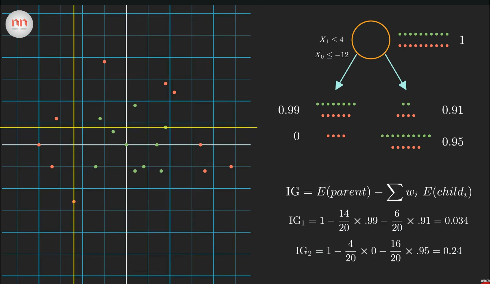
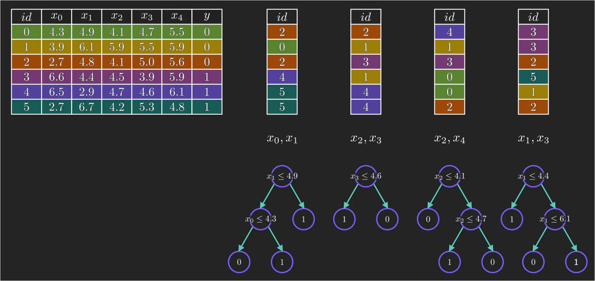

## Introduction

Random Forest is a machine learning algorithm based on an ensemble of decision trees. Instead of relying on a single decision tree, Random Forest trains many trees and combines their predictions. For a classification problem, the final prediction is usually determined by majority voting:

$$
\hat{y}
=
\operatorname{mode}
\left(
\hat{y}_1,
\hat{y}_2,
\ldots,
\hat{y}_N
\right),
$$

where $\hat{y}_i$ is the prediction made by the $i$-th decision tree. For regression, the predictions are usually averaged:

$$
\hat{y}
=
\frac{1}{N}
\sum_{i=1}^{N}
\hat{y}_i.
$$

## Entropy and IG (Information Gain)
The key idea behind a decision tree is to progressively split the dataset into increasingly homogeneous groups. To measure how mixed a node is, we can use entropy:

$$
-\sum_{i=1}^{N}
p_i \log p_i,
$$

where $p_i$ is the proportion of samples belonging to class $i$. A node has low entropy when most samples belong to the same class, while a highly mixed node has high entropy. For example, in a binary classification problem: $E=0$ if all samples belong to the same class, whereas $E=1$ when the two classes are equally represented.

When considering a possible split, the decision tree calculates the Information Gain (IG):
$$
IG=
E(\text{parent})-
\sum_i
w_i E(\text{child}_i),
$$

where $w_i=\frac{N_i}{N}$ is the proportion of samples assigned to the $i$-th child node. Therefore, the tree prefers a split that produces children with lower entropy.

Since $E(\text{parent})$ is fixed when choosing a split at a particular node,

$$
\max IG
\quad\Longleftrightarrow\quad
\min
\sum_i w_i E(\text{child}_i).
$$

In this sense, the construction of a decision tree can be viewed as a greedy process that locally minimizes the uncertainty of the data at every step.



## Why Is It Called a Random Forest?
A Random Forest is called “random” because randomness is deliberately introduced when constructing each decision tree. Instead of training every tree on exactly the same dataset, each tree is trained on a bootstrap sample, which is generated by randomly sampling observations from the original dataset with replacement. Therefore, some samples may appear multiple times while others may not appear at all. In addition, when a tree decides how to split a node, it does not necessarily consider all available features. Instead, it randomly selects a subset of features and then chooses the best split among them, typically by maximizing the Information Gain (or equivalently minimizing the impurity after the split). For example, if the original dataset contains features $x_0,x_1,x_2,x_3,x_4$, one split may only consider $x_0$ and $x_1$, while another may consider $x_2$ and $x_4$. As a result, different trees are exposed to different samples and different candidate features, so they naturally develop different structures and make somewhat different predictions.



After all trees have been trained, their predictions are combined through a voting process. For a classification problem, the same input sample is passed through every tree, and each tree independently outputs a predicted class. The Random Forest then counts how many trees voted for each class and chooses the class receiving the largest number of votes. For example, if five trees produce predictions $[0,1,1,1,0]$, then class $1$ receives three votes while class $0$ receives two, so the final prediction is class $1$. In general, this can be written as $\hat{y}=\operatorname{mode}(\hat{y}_1,\hat{y}_2,\ldots,\hat{y}_T)$, where $T$ is the number of trees. For regression, there is no majority vote because the outputs are continuous values; instead, the predictions from all trees are averaged. This aggregation is important because a single decision tree can be unstable and sensitive to the particular training samples it sees, while combining many partially independent trees tends to cancel out individual errors and produces a more stable prediction. Therefore, the name Random Forest is quite literal: “random” refers to the random sampling of training observations and candidate features, while “forest” refers to the collection of many decision trees whose outputs are finally combined by voting or averaging.

## A Simple Random Forest Example

We first import the required packages.

```python
from sklearn.datasets import load_iris
from sklearn.model_selection import train_test_split
from sklearn.ensemble import RandomForestClassifier
from sklearn.metrics import accuracy_score
```

Here we use the Iris dataset as a simple classification example.

```python
data = load_iris()

X = data.data
y = data.target
```

The matrix `X` contains the input features, while `y` contains the corresponding class labels.

We then divide the dataset into a training set and a test set.

```python
X_train, X_test, y_train, y_test = train_test_split(
    X,
    y,
    test_size=0.2,
    random_state=42
)
```

Here, `test_size=0.2` means that 20% of the data is used for testing and the remaining 80% is used for training.

## Training the Random Forest

We can construct a random forest using `RandomForestClassifier`.

```python
model = RandomForestClassifier(
    n_estimators=100,
    max_depth=None,
    random_state=42
)
```

The parameter

```python
n_estimators=100
```

means that the random forest contains 100 decision trees.

We then train the model:

```python
model.fit(X_train, y_train)
```

Conceptually, the random forest can be written as

$$
\text{Random Forest}
=
\{
\text{Tree}_1,
\text{Tree}_2,
\ldots,
\text{Tree}_N
\}.
$$

Each tree is trained using a slightly different subset of the data and features.

## Prediction

After training, we can use the model to make predictions on the test set.

```python
y_pred = model.predict(X_test)
```

Each decision tree produces its own prediction.

For example,

$$
\text{Tree}_1 \rightarrow 0,
$$

$$
\text{Tree}_2 \rightarrow 1,
$$

$$
\text{Tree}_3 \rightarrow 1,
$$

$$
\text{Tree}_4 \rightarrow 1.
$$

Since most trees predict class $1$, the final prediction of the random forest is

$$
\hat{y}=1.
$$

## Evaluation

The classification accuracy can be calculated using

```python
accuracy = accuracy_score(y_test, y_pred)

print("Accuracy:", accuracy)
```

The accuracy is defined as

$$
\text{Accuracy}
=
\frac{
\text{Number of correct predictions}
}{
\text{Total number of predictions}
}.
$$

## Using Your Own Data

For example, suppose we have a small dataset with two features:

```python
X = [
    [1.2, 3.4],
    [2.1, 4.2],
    [5.3, 1.2],
    [6.1, 0.8]
]

y = [0, 0, 1, 1]
```

We can train a random forest directly:

```python
from sklearn.ensemble import RandomForestClassifier

model = RandomForestClassifier(
    n_estimators=100,
    random_state=42
)

model.fit(X, y)
```

Then we can classify a new sample:

```python
prediction = model.predict([
    [2.0, 3.0]
])

print(prediction)
```

## Random Forest Regression

Random Forest can also be used for regression.

Instead of `RandomForestClassifier`, we use `RandomForestRegressor`.

```python
from sklearn.ensemble import RandomForestRegressor

model = RandomForestRegressor(
    n_estimators=100,
    random_state=42
)
```

For regression, each tree predicts a numerical value:

$$
\hat{y}_1,
\hat{y}_2,
\ldots,
\hat{y}_N.
$$

The final prediction is the average:

$$
\hat{y}
=
\frac{1}{N}
\sum_{i=1}^{N}
\hat{y}_i.
$$

## Summary

The basic workflow of a Random Forest model is:

1. Prepare the input features $X$ and labels $y$.
2. Split the dataset into training and testing sets.
3. Construct multiple decision trees.
4. Train the Random Forest.
5. Combine the predictions from different trees.
6. Evaluate the performance on the test set.

The key advantage of Random Forest is that combining many different decision trees usually gives better generalization than relying on a single tree.