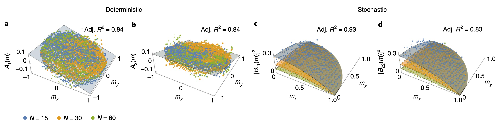

## Motivation
Theories of active matter have long been used to describe collective motion in systems ranging from self-propelled particles and bacteria to animal groups. In particular, the Toner–Tu theory predicts that long-range polar order can persist as $N\to\infty$. In contrast, a 2020 study published in Nature Physics reported that, for the fish schools studied experimentally, highly polarized motion became more likely as group size decreased. The authors explained this behavior using a finite-size multiplicative-noise SDE. More strikingly, they inferred a remarkably simple microscopic pairwise copying mechanism that reproduces the functional form of the empirically extracted SDE. This microscopic-to-mesoscopic derivation feels very much like a physicist’s way of explaining a phenomenon and makes me admire it deeply.

## Two Dimensional Random Walk: How does the radius scale with step number N?
Before discussing the interaction-induced ordering of fish schools, it is useful to first establish the polarization expected from a completely disordered group purely due to finite-size fluctuations. If we represent the direction of fish $i$ as a unit vector $\vec{​v_i}$ and define the group polarization index as:
$$
\vec M=\frac{1}{N}\sum _i \vec{​v_i}
$$

then in the totally random case, $\sum _i \vec{​v_i}$ is the result of a 2D random walk. Rewrite $\vec{​v_i}$ in the matrix form:

$$
\vec{v_i}
=
\begin{pmatrix}
\cos\theta_i \\
\sin\theta_i
\end{pmatrix},
\qquad
\sum _i \vec{​v_i}=
\begin{pmatrix}
\sum _i\cos\theta_i \\
\sum _i\sin\theta_i
\end{pmatrix}
$$

Given that $\mathbb{E}[\cos\theta_i]=\mathbb{E}[\sin\theta_i]=0$ and their second moments:
$$
\mathbb{E}[\cos^2\theta_i]=\mathbb{E}[\sin^2\theta_i]=\frac{1}{2\pi}\int_0^{2\pi}d\theta_i\,\sin^2\theta_i=\frac{1}{2}
$$

The variance should be 
$$
\text{Var}[\cos\theta_i]=\text{Var}[\sin\theta_i]=\mathbb{E}[\sin^2\theta_i]-\mathbb{E}^2[\sin\theta_i]=\frac{1}{2}
$$

We can add up independent variances and write the variance of $\sum _i\cos\theta_i$ as:
$$
\text{Var}[\sum _i\cos\theta_i]=\sum _i\text{Var}[\cos\theta_i]=\frac{N}{2}
$$

In a coarse fashion, the radius has the scale $\sqrt{\left(\sqrt\frac{N}{2}\right)^2+\left(\sqrt\frac{N}{2}\right)^2}=\sqrt{N}$. More precisely, since $\cos\theta_i$ has a finite expectation and variance, the addition of itself should follow a Gaussian distribution as N goes to infinity. Therefore, the radius is given by:

$$
R=\sqrt{X^2+Y^2}, \qquad X,Y\sim \mathcal{N}(0,\frac{N}{2})
$$

The joint probability density of $X,Y$ is

$$
p_{X,Y}(x,y)
=
\frac{1}{\pi N}
\exp\left(
-\frac{x^2+y^2}{N}
\right)
$$

Now represent the whole system in terms of radius $r$ and angle $\phi$, the joint density of $(R,\Phi)$ is

$$
p_{R,\Phi}(r,\phi)
=
p_{X,Y}(r\cos\phi,r\sin\phi)\,r
=
\frac{r}{\pi N}
\exp\left(
-\frac{r^2}{N}
\right)
$$

Integrating over the angular variable $\phi\in[0,2\pi)$ gives the marginal distribution of $R$ (Rayleigh distribution):

$$
p_R(r)
=
\int_0^{2\pi}
p_{R,\Phi}(r,\phi)\,d\phi
=
\frac{2r}{N}
\exp\left(
-\frac{r^2}{N}
\right),
\qquad r\ge0
$$

The expectation of $R$ is therefore

$$
\mathbb E[R]
=
\int_0^\infty
dr\,r\,p_R(r)
=
\frac{2}{N}
\int_0^\infty
r^2
\exp\left(
-\frac{r^2}{N}
\right)
dr=\frac{\sqrt{\pi}}{2}\cdot \sqrt{N}
$$

The length of polarization index is $\frac{R}{N}$, i.e.
$$
\mathbb E[|\vec M|]=\frac{\sqrt{\pi}}{2}\cdot \frac{1}{\sqrt{N}}
$$

This partly explains why researchers found that large groups have lower polarization index. However, experiments in Etroplus suratensis show that when $N$ is small (15 fishes), the modulus of $\vec M$ is approximately $1$, which is highly unlikely to happen in a random walk system. 

The researchers proposed a noise-induced model to explain this phenomenon, which is very intuitive. If the differentiation of polarization $\vec M$ could be expressed in terms of the addition of a drift term and a random term:

$$
d\vec M=\mathbf{A}(\vec M)dt+\mathbf{B}(\vec M)\cdot \mathbf{\vec\eta}(t) \cdot dt
$$

If $\mathbf{B}(\vec M)$ is very large when $|\vec M|\to 0$, then the random fluctuations will bring $|\vec M|$ to approximately $1$ again, thus this mechanism will make the system highly polarized. The final form of this SDE given by this article is:

$$
d\vec M=-\alpha \vec Mdt+\sqrt{\frac{\beta(1-|\vec M|^2)+\alpha}{N}}\cdot \mathbf{\vec\eta}(t) dt
$$

Consistent with what we said before, the fluctuation term is the largest when $|\vec M|\to 0$. Meanwhile, the smaller $N$ is, the larger fluctuation is, so fish group will be more aligned with smaller $N$. The following section will explain how this SDE is derived from data.

## Extraction of an SDE from data
First, we assume that the mesoscopic dynamics can be approximated by an Itô SDE driven by Gaussian white noise (the markov property is implemented by choosing a proper timescale that could diminish the temperal correlation). Under this assumption, the dynamics can be written as (just set $B$ to $0$ if the process is deterministic):
$$
d\vec M=\vec A(\vec M)dt+\mathbf{B}(\vec M)d\vec W=
\begin{pmatrix}
A_x \\
A_y
\end{pmatrix}dt+
\begin{pmatrix}
B_{11} \, B_{12} \\
B_{21} \, B_{22}
\end{pmatrix}
\begin{pmatrix}
dW_x \\
dW_y
\end{pmatrix}=
\begin{pmatrix}
A_xdt+B_{11}dW_x+B_{12}dW_y \\
A_ydt+B_{11}dW_x+B_{12}dW_y
\end{pmatrix}
$$

where $dW_x$ and $dW_y$ are the brownian increments in two different dimensions:
$$
dW_x=\xi_x \cdot \sqrt{dt}\,,\,dW_x=\xi_y \cdot \sqrt{dt}\,, \qquad\xi_x,\xi_y\sim\mathcal{N}(0,1)
$$

To extract the stochaticity, let's define two expectations that pretty much like the moments of a random variable. The first one is called "first jump moment" and is defined as $\mathbb{E}\left[\frac{d\vec M}{dt}\right]$. To calculate this, we need to keep in mind that the expectation of brownian increments is always $0$, thus:
$$
\mathbb{E}\left[\frac{d\vec M}{dt}\right]=
\mathbb{E}\left[
\begin{pmatrix}
A_x+\frac{1}{dt}B_{11}dW_x+\frac{1}{dt}B_{12}dW_y \\
A_y+\frac{1}{dt}B_{11}dW_x+\frac{1}{dt}B_{12}dW_y
\end{pmatrix}
\right]=
\begin{pmatrix}
A_x \\
A_y
\end{pmatrix}
$$

Therefore, the first jump momemt represents the deterministic part of the system, i.e. $\vec A(\vec M)$ in the SDE. The "second jump moment" is defined as $\mathbb{E}\left[\frac{(d\vec M)(d\vec M)^T}{dt}\right]$, again:
$$
\mathbb{E}\left[\frac{(d\vec M)(d\vec M)^T}{dt}\right]=
\mathbb{E}\left[\frac{\left(\vec A(\vec M)dt+\mathbf{B}(\vec M)d\vec W\right)\left(\vec A(\vec M)dt+\mathbf{B}(\vec M)d\vec W\right)^T}{dt}\right]
$$

$$
=\mathbb{E}\left[\frac{\vec A\vec A^Tdt^2+\mathbf{B}d\vec WA^Tdt+Ad\vec W^T\mathbf{B}^Tdt+\mathbf{B}d\vec Wd\vec W^T\mathbf{B}^T}{dt}\right]=
\mathbb{E}\left[\vec A\vec A^Tdt\right]+\mathbb{E}\left[\mathbf{B}d\vec Wd\vec W^T\mathbf{B}^T/dt\right]
$$

Given that the brownian nature of $d\vec W$, $\mathbb{E}[d\vec Wd\vec W^T]$ should be $\mathbf{I} \cdot dt$, therefore
$$
\mathbb{E}\left[\frac{(d\vec M)(d\vec M)^T}{dt}\right]=\mathbb{E}\left[\vec A\vec A^T\right]dt+\mathbb{E}\left[\mathbf{B}\mathbf{B}^T\right]\frac{dt}{dt}\xrightarrow{dt\to0}\mathbf{B}\mathbf{B}^T
$$

The second jump moment represents the stochastic part of the system, but it's not directly $\mathbf{B}(\vec M)$, it's $\mathbf{B}\mathbf{B}^T(\vec M)$ instead. Through experiments, we could easily calculate the first and second jump moments by replacing $\frac{d\vec M}{dt}$ with $\frac{\Delta \vec M}{\Delta t}$. By doing this, the researchers could obtain $\vec A(\vec M)$ and $\mathbf{B}\mathbf{B}^T(\vec M)$ at every $\vec M$.

## The exact PDF of polarization index induced by pair-wise copying
